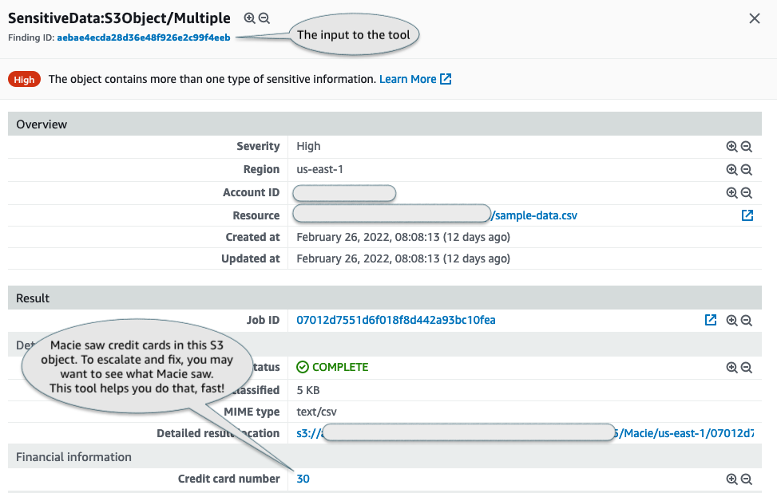
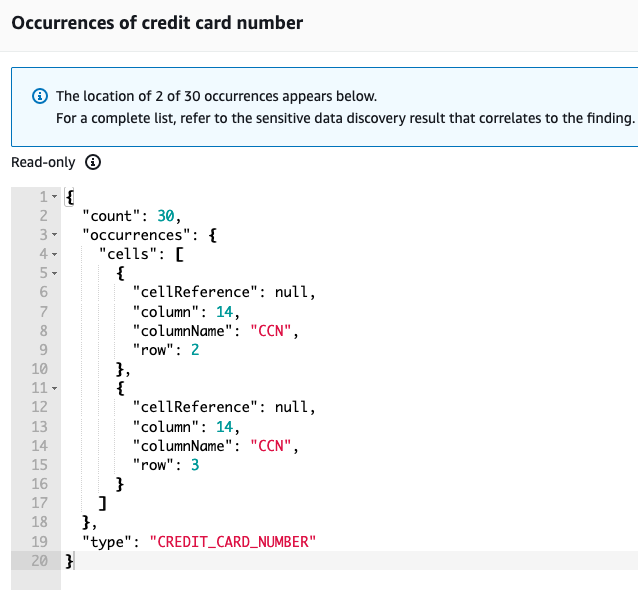

### Macie Finding Data Reveal

This project contains a command line utility to help you investigate the sensitive data associated
with Macie findings. Macie generates sensitive data findings when it discovers sensitive data in S3
objects that you configure a sensitive data discovery job to analyze. The finding includes
[locators] that point to where the specific sensitive data was observed. The operator can follow
these pointers to see what Macie saw in the object. This follow-up helps the operator (usually a
security engineer) validate that the discovered data is a true positive and decide what to do next
with the specific finding and the object where the data was discovered. The CLI in this package
automates the manual steps involved with retrieving the object where the sensitive data was
discovered and viewing the discovered sensitive data based on its location.

[locators]: https://docs.aws.amazon.com/macie/latest/user/findings-locate-sd.html

For example, say you're looking at a finding like the following:



Often the next step, i.e. remediation or confirmation of security controls (like encryption,
access-logging, etc.)  depends on determining the accuracy and severity of the findings. Macie shows
the occurrences that are often sufficient to make the decision.




Macie also provides the location of the sensitive data within the object that the finding is for.
If you need to see the exact discovered data in order to make a decision on what to do with the
finding this tool can be used to reveal the sensitive data contained within the object.

### Build and Install

This is a Gradle Kotlin project. To build, you need Java 11:

```bash
> git clone https://github.com/aws-samples/amazon-macie-finding-data-reveal
> cd amazon-macie-finding-data-reveal

> ./gradlew build
```

The build produces an executable jar that you can run with Java 11. For convenience you may want to
define an alias:

```bash
> alias reveal="java -jar ${PWD}/reveal/build/libs/reveal-executable.jar"
```

### Permissions

The tool makes use of public API calls to S3 and Macie, so the usual IAM access control applies. The
caller needs to have the permissions to invoke `macie:GetFindings` on the account and `s3:GetObject`
on the specific object reported in the finding.


### Usage

The tool makes API calls to Macie and S3 and you'd need to configure [credentials] as you do for use
with AWS ClI.

[credentials]: https://docs.aws.amazon.com/cli/latest/userguide/cli-configure-files.html

```bash
# Locate where your finding and object are
> export AWS_REGION=us-east-1

# Pick the Finding ID from the console and reveal it (all values below are fake)
> reveal 8db5d79296b57dade4abeb2b9a5a8797
┌────────┬────────────────────────────────────────────────────────┐
│ Object │ s3://DOC-EXAMPLE-BUCKET/mock-data/json/50169671.json   │
├────────┼────────────────────────────────────────────────────────┤
│ Mime   │ application/json                                       │
├────────┼────────────────────────────────────────────────────────┤
│ Count  │ 493                                                    │
└────────┴────────────────────────────────────────────────────────┘
┌──────────────┐
│ PHONE_NUMBER │
├──────────────┤
│ 555-0100     │
├──────────────┤
│ 555-0100     │
├──────────────┤
│ 555-0100     │
└──────────────┘
┌────────────────────┐
│ NAME               │
├────────────────────┤
│ Alejandro Rosalez  │
├────────────────────┤
│ Diego Ramirez      │
├────────────────────┤
│ Martha Rivera      │
└────────────────────┘
┌────────────────────────┐
│ ADDRESS                │
├────────────────────────┤
│ 12 Any Street Any Town │
├────────────────────────┤
│ 34 Any Street Any Town │
├────────────────────────┤
│ 11 Any Street Any Town │
└────────────────────────┘
```

### Can I Reveal all findings?

No. Macie scans a wide variety of objects in S3 buckets, ranging from small text files to large
archives that hold hundreds of GBs of data. This tool helps you take a quick peek at the most common
finding types findings to confirm the presence of sensitive data. Currently, the following
mime-types are supported:

- `application/avro`
- `text/csv`
- `application/json`
- `text/plain`
- `application/parquet`
- `application/vnd.openxmlformats-officedocument.spreadsheetml.sheet` (Excel spreadsheets)

Please create an issue if a format you'd like to see isn't on the list. We'll try to add it,
contributions are welcome too!

### Troubleshooting

#### Mismatched bucket region
Error:
```
ERROR: The bucket you are attempting to access must be addressed using the specified endpoint. Please send all future requests to this endpoint (Service: S3, Status Code: 301)
```
Cause:

The tool uses regional endpoints. Set `AWS_REGION` to match where your Macie session is.

## Security

See [CONTRIBUTING](CONTRIBUTING.md#security-issue-notifications) for more information.

## License

This project is licensed under the MIT-0 License. See the LICENSE file.
